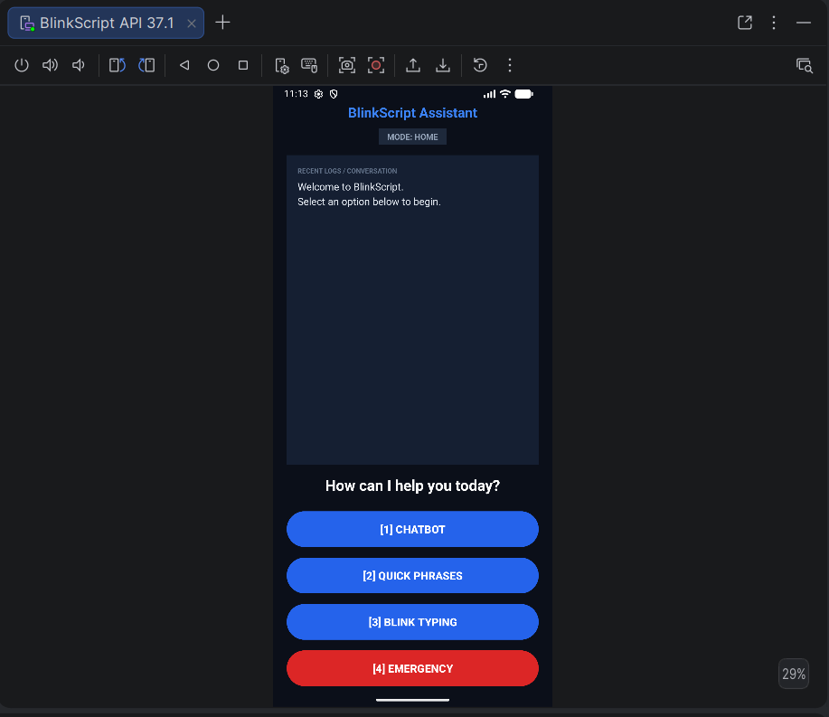
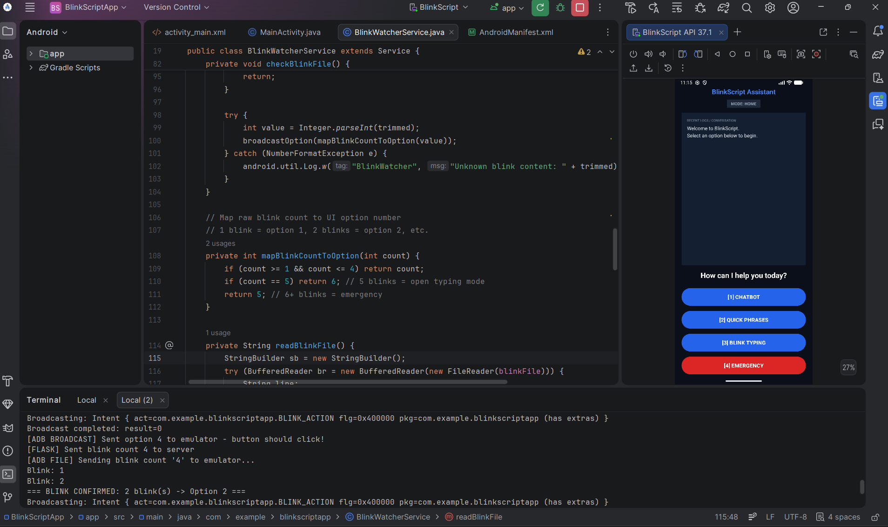
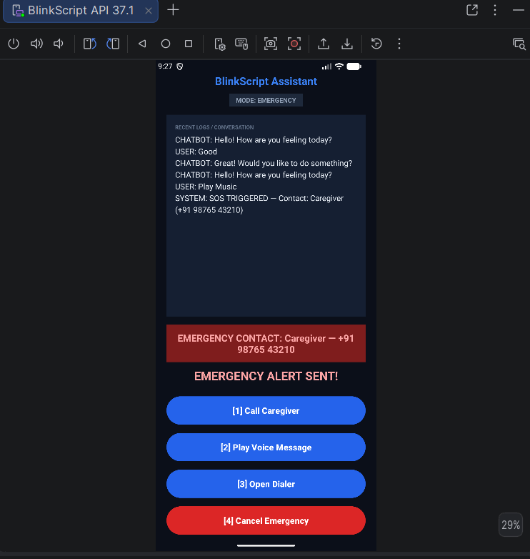

\# BlinkScript

BlinkScript is an assistive communication system that converts eye blinks into text and displays the output on an Android application. It is designed to help people with speech or mobility impairments communicate using eye blinks.

\## Features

\- 👁️ Real-time eye blink detection using OpenCV

\- 📝 Blink-to-text conversion

\- 📱 Android app for displaying messages

\- ⚡ Real-time communication

\- 💬 Easy-to-use interface

\## Technologies Used

\- Python

\- OpenCV

\- Java

\- Android Studio

\- XML

\- Gradle

\## Project Structure

\- `app/` - Android application

\- `backend.py` - Backend processing

\- `blink\_detect.py` - Blink detection logic

\- `templates/` - HTML templates

## Application Screenshots

### Home Screen

### Blink Detection

### Quick Phrases

### Emergency SOS

## Future Improvements
\## Future Improvements

\- Voice output

\- SOS emergency alerts

\- AI-based word prediction

\- Multi-language support

\## Author

\*\*Sanjana Patil\*\*

